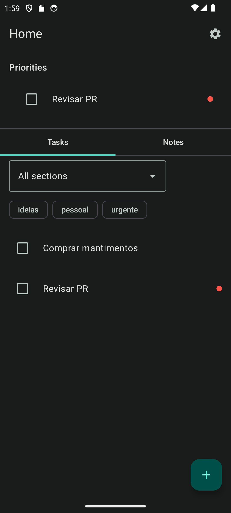
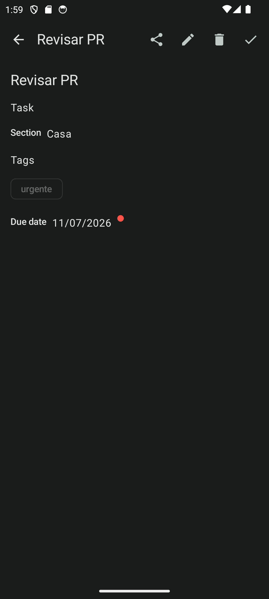
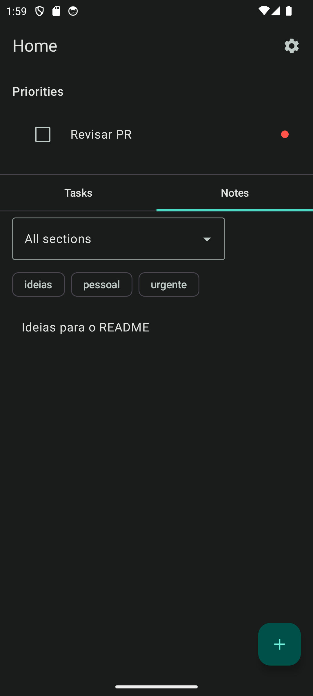
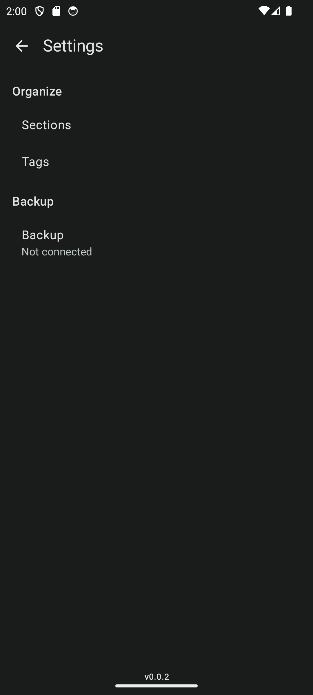
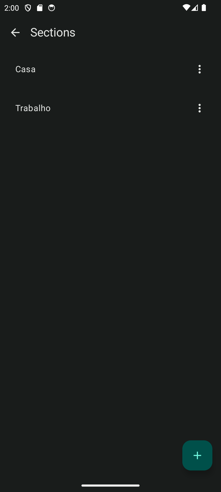

# unideas

Gerenciador de tarefas e anotações para Android, nativo, com painel de prioridades sempre visível (o que está vencido ou vencendo primeiro) e organização por seções e tags.

<p align="center">
  
  
  
  
</p>

🚧 **Alpha (`0.0.x`)** — MVP funcional (milestone [`v0.1.0 — MVP`](https://github.com/SeuCaiOo/unideas/milestone/1), 28 issues fechadas), builds de teste distribuídos via Firebase App Distribution.

## Screenshots

Capturas de tela do APK de **release** rodando em emulador:

| Home (painel de prioridades) | Detalhe do item | Notas + filtros |
| :---: | :---: | :---: |
|  |  |  |

| Configurações | Gerenciar Seções |
| :---: | :---: |
|  |  |

<details>
<summary><h2>🏛️ Arquitetura e Stack</h2></summary>

Multi-módulo (Clean Architecture + MVI, sem KMP): `:app` + `:domain`, `:data`, `:core:common`, `:core:ui`, `:core:backup`, `:feature:{home,items,sections,tags,settings}`. Detalhes completos em [`docs/ARCHITECTURE.md`](docs/ARCHITECTURE.md); navegação em [`docs/FLOW.md`](docs/FLOW.md).

| Camada | Tecnologia |
|---|---|
| Linguagem | Kotlin 2.2.10 |
| UI | Jetpack Compose, Material 3 |
| Gerenciamento de estado | ViewModel + StateFlow (padrão MVI: UiState/UiAction/Event) |
| Persistência | Room |
| DI | Koin |
| Backup | Google Drive API (sign-in escopado, sem Firebase Auth) |
| Qualidade | Detekt (análise estática) + Kover (cobertura de testes) |
| Testes | JUnit4, MockK, Turbine |
| Build | Gradle KTS, AGP 9.2.1 |

**Min SDK:** 24 · **Target/Compile SDK:** 37 · **JVM:** 11

</details>

<details>
<summary><h2>✨ Funcionalidades</h2></summary>

- Painel de prioridades fixo (vencidos + vencendo em breve), sempre visível na Home
- Tarefas e anotações organizadas por abas, com filtro por seção e tags
- Recorrência de tarefas (diária/semanal/mensal) — ao concluir, a próxima instância nasce automaticamente
- Gerenciamento de seções e tags (criar/renomear/excluir, com bloqueio se houver itens vinculados)
- Backup e restore via Google Drive (`appDataFolder`, sign-in escopado)
- Tema Material 3 dark/light, indicador de urgência (vermelho/âmbar reservados exclusivamente pra prazo)

</details>

## Getting Started

```bash
# Clone o repositório
git clone git@github.com:SeuCaiOo/unideas.git

# Build e instala o APK debug
./gradlew installDebug
```

## Contributing

Veja [AGENTS.md](AGENTS.md) / [CLAUDE.md](CLAUDE.md) para diretrizes de desenvolvimento.
